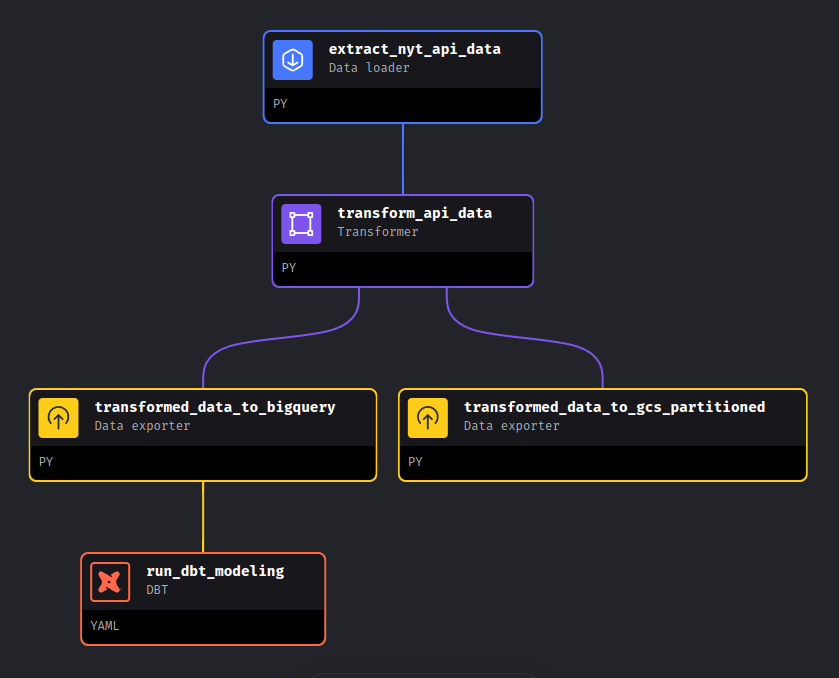
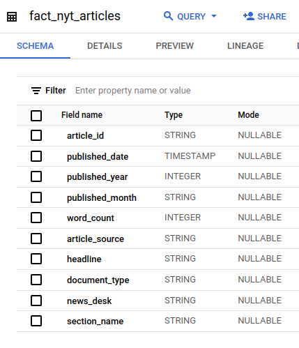
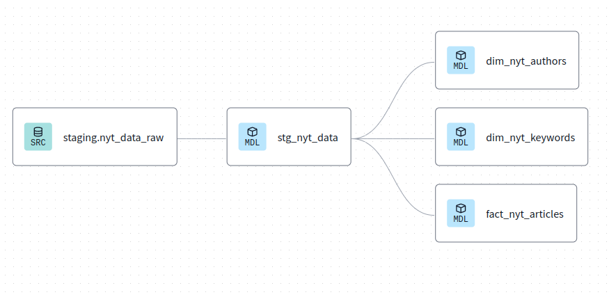

# New York Times articles dashboard
ETL pipeline on the New York Times data with Looker for data visualization

## Motivation
I've always been interested in reading the news and it can be hard to get data analysis on news article produced.
I choose the New York Times because you could access their data easily through an API.

## Data source

I'm using metadata about historical articles from the New York time. Their data goes all the way back to 1852 but I only used data since 2000.

https://developer.nytimes.com/docs/archive-product/1/overview

## Instructions:

Since it would be too long to include them here, go check the instructions [here](./RUN_PROJECT.md)

If you encounter a problem when trying to run the project don't hesitate to create an [issue](https://github.com/max-lutz/nyt_articles_analytics_dashboard/issues) on github so I can have a look and help you.

## Solution

- Tools and infrastructure
- Data Lake: Google cloud storage
- Data warehouse: BigQuery
- Data pipeline: Python in Mage AI
- Analytics engineering: dbt
- Orchestration: Mage AI (triggrer and [backfill](./images/backfill.png) for historical data)
- Data visualization: Looker

#### Data pipeline

#### ETL pipeline

#### Data modeling

I modeled my data in three tables:
- a fact table
- a keyword dimension table (relationship many-to-many)
- a authors dimension table (relationship many-to-many)

Fact table: 

Data lineage:

## Results
[Dashboard](https://lookerstudio.google.com/reporting/46e544c3-9e40-49d3-9da5-e9075f72631c)

