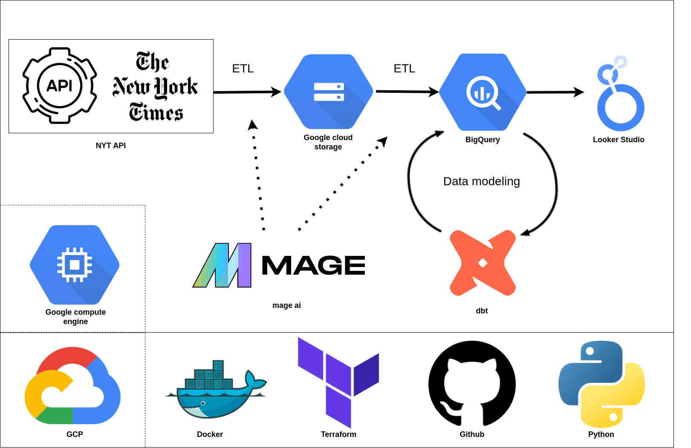

# New York Times articles dashboard
ETL pipeline on the New York Times data with Looker for data visualization

## Motivation
I've always been interested in reading the news and it can be hard to get data analysis on news article produced.
I choose the New York Times because you could access their data easily through an API.

## Data source

https://developer.nytimes.com/docs/archive-product/1/overview

## Solution

- Tools and infrastructure
- Data Lake: Google cloud storage
- Data warehouse: BigQuery
- Data pipeline: Python in Mage AI
- Analytics engineering: dbt
- Orchestration: Mage AI (triggrer and backfill for historical data)
- Data visualization: Looker

	
	
CI/CD:
- implement CI/CD as if this project was always in production and we used CI/CD to add features to it.

## Results
[Dashboard](https://lookerstudio.google.com/reporting/46e544c3-9e40-49d3-9da5-e9075f72631c)

## Inspiration
https://github.com/LoHertel/diplomats-in-germany/tree/main

## Instructions:
Go check the instructions [here](./RUN_PROJECT.md)
